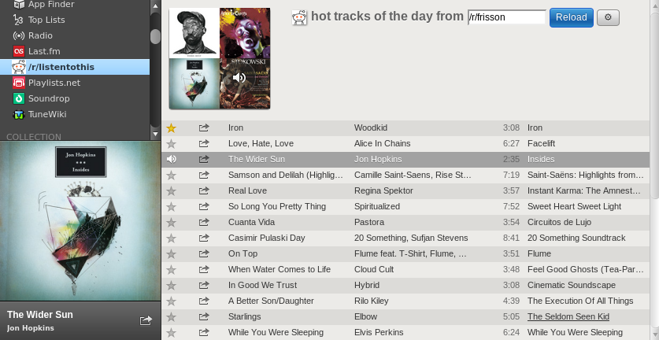

# /r/listentothis

Please follow the [Spotify App Developer Tutorial](https://developer.spotify.com/technologies/apps/tutorial/) on getting the app loaded into your Spotify client.

At the moment the app just greps the top of any /r/ page and displays them in a playlist.

Main logic can be found in listentothis.js

# TODO

* Allow to queue list
* Allow ability to view results for hot, new, controversial, top, saved
* Allow ability to select number of songs to view
* Allow ability to send tracks to a playlist
* Make the app look better with some nice CSS
